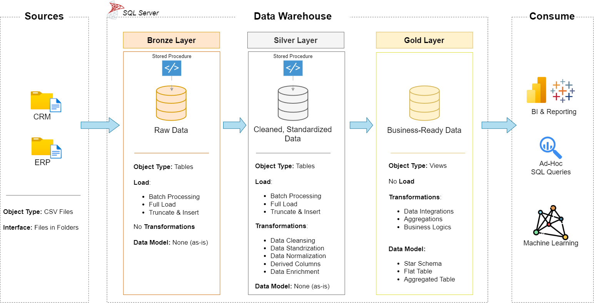

# SQL-Data-Warehouse-Project
Building a modern data warehouse with SQL Server, including ETL processes, data modeling, and analytics.

---
# Project Requirements
Building the Data Warehouse (Data Engineering)
## Objective
Develop a modern data warehouse using **SQL Server** to consolidate sales data, enabling analytical reporting and informed decision-making.

## Specifications
- Data Sources: Import data from two source systems (ERP and CRM) provided as CSV files.
- Data Quality: Cleanse and resolve data quality issues prior to analysis.
- Integration: Combine both sources into a single, user-friendly data model designed for analytical queries.
- Scope: Focus on the latest dataset only; historization of data is not required.
- Documentation: Provide clear documentation of the data model to support both business stakeholders and analytics teams.

---
The data architecture for this project follows Medallion Architecture **Bronze**, **Silver**, and **Gold** layers:
1. **Bronze Layer**: Stores raw data as-is from the source systems. Data is ingested from CSV Files into SQL Server Database.
2. **Silver Layer**: This layer includes data cleansing, standardization, and normalization processes to prepare data for analysis.
3. **Gold Layer**: Houses business-ready data modeled into a star schema required for reporting and analytics.


---
# Repository Structure
```
data-warehouse-project/
│
├── datasets/                           # Raw datasets used for the project (ERP and CRM data)
│
├── docs/                               # Project documentation and architecture details
│   ├── data_architecture.png           # Shows the project's architecture
│   ├── data_catalog.md                 # Catalog of datasets, including field descriptions and metadata
│   ├── data_flow.png                   # PNG file for the data flow diagram
│   ├── data_models.png                 # PNG file for data models (star schema)
│   ├── naming-conventions.md           # Consistent naming guidelines for tables, columns, and files
│
├── scripts/                            # SQL scripts for ETL and transformations
│   ├── bronze/                         # Scripts for extracting and loading raw data
│   ├── silver/                         # Scripts for cleaning and transforming data
│   ├── gold/                           # Scripts for creating analytical models
│   ├── init_database.spl               # Scripts for creating Database and Schemas
│
├── tests/                              # Test scripts and quality files
│
├── README.md                           # Project overview and instructions
└── LICENSE                             # License information for the repository
```
